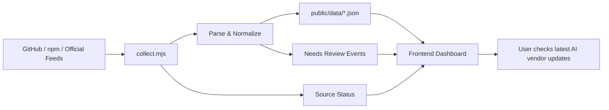

<div align="center">

# 🚀 Vendor Pulse / Agent Pulse

**一个面向 AI 开发者的厂商更新速览页：聚合 Agent 工具、新模型发布、弃用政策与官方来源健康状态。**

让你不用反复刷 GitHub、npm、Release Notes 和厂商公告，也能快速知道：
**哪些 Agent 工具在更新、哪些模型刚发布、哪些 API / 模型即将弃用。**

<br />

🔗 **在线预览 / GPT 站点部署地址：** [agent-pulse-ai.tdo770756.chatgpt.site](https://agent-pulse-ai.tdo770756.chatgpt.site)

<br />


</div>

---

## ✨ 项目简介

**Vendor Pulse** 是一个轻量、免费、可自动更新的 AI 厂商动态看板。它会从公开来源中采集信息，并整理成前端页面可直接读取的静态 JSON 数据。

项目重点关注三类信息：

- 🤖 **Agent / Coding 工具动态**：GitHub Star、npm 版本、最新 Release、近期更新节奏
- 🧠 **新模型发布信号**：OpenAI、Anthropic、Google AI 等官方发布说明中的模型更新
- ⚠️ **弃用 / 迁移政策**：API、模型、旧能力的下线、迁移、弃用提醒
- 🛰️ **来源健康度**：每个官方来源是否采集成功、是否需要人工核验

> 项目原则：只基于 GitHub、npm、厂商官网、RSS、Release Notes 等公开来源，不伪造发布事件；来源异常时保留上次有效数据，并标记状态。

---

## 🧩 核心功能

| 功能 | 说明 |
| --- | --- |
| 🔄 自动采集 | 通过脚本从 GitHub、npm、厂商官网、RSS 等公开来源拉取数据 |
| 📈 工具趋势 | 展示 Agent 工具的 Star、npm 版本、周下载量、最新 Release |
| 🧠 模型动态 | 追踪 GPT、Claude、Gemini 等模型相关发布说明 |
| ⚠️ 弃用提醒 | 识别模型/API 下线、迁移、Deprecated 等政策变化 |
| 🧪 待核验机制 | 页面变化但无法确定具体事件时，标记为 `needs_review` |
| 📦 静态数据输出 | 采集结果写入 `public/data/`，前端可以直接读取 |
| 🛡️ 失败兜底 | 解析失败时保留旧数据，避免页面因为单个来源异常而整体不可用 |
| ⚡ 前端自动同步 | 页面打开后定时检查最新快照，重新聚焦或网络恢复时也会刷新 |

---

## 🖼️ 页面能力预览

> 建议后续把项目首页截图放到 `public/preview.png`，然后取消下面这一行注释，让 README 更直观。

<!--  -->

当前页面主要展示：

- Agent 工具脉冲卡片
- 新模型发布事件
- 弃用 / 迁移政策
- 来源健康度
- 待核验事件
- Star 快照与变化趋势

---

## 🛠️ 技术栈

| 模块 | 技术 |
| --- | --- |
| 前端 | React 19、TypeScript、Tailwind CSS |
| 构建 / 运行 | Vinext、Vite、Next.js |
| 数据采集 | Node.js、GitHub API、npm Registry、HTML/RSS 解析 |
| 自动化 | GitHub Actions |
| 数据存储 | 静态 JSON 文件：`public/data/*.json` |
| 测试与质量 | Node Test Runner、ESLint、TypeScript |
| 部署扩展 | GitHub Pages / Cloudflare Worker / 静态站点均可扩展 |

---

## 🧱 项目结构

```txt
vendor-pulse/
├─ app/                    # 前端页面、交互逻辑与样式
├─ data/
│  └─ sources.json          # 工具、模型、官网 feed 配置
├─ public/
│  └─ data/                 # 采集生成的静态 JSON 快照
├─ scripts/
│  └─ collect.mjs           # 核心采集脚本
├─ tests/                   # 测试用例
├─ worker/                  # Worker 入口，便于后续部署扩展
├─ .github/workflows/       # GitHub Actions 自动采集流程
├─ package.json             # 项目脚本与依赖
└─ README.md
```

---

## 🔁 数据流



---

## 🚀 快速开始

### 1. 克隆项目

```bash
git clone https://github.com/DoTrungHuy/vendor-pulse.git
cd vendor-pulse
```

### 2. 安装依赖

```bash
npm install
```

> 推荐 Node.js 版本：`>= 22.13.0`

### 3. 采集最新数据

```bash
npm run collect
```

该命令会从 GitHub、npm、RSS、Release Notes、Deprecation 页面等公开来源采集数据，并写入 `public/data/`。

可选：本地设置 `GITHUB_TOKEN` 可以降低 GitHub API 限流风险。

```bash
# macOS / Linux
export GITHUB_TOKEN=your_token_here

# Windows PowerShell
$env:GITHUB_TOKEN="your_token_here"
```

### 4. 本地运行

```bash
npm run dev
```

然后打开终端提示的本地地址，通常是：

```txt
http://localhost:5173
```

### 5. 测试与检查

```bash
npm test
npm run typecheck
npm run lint
```

---

## 📦 可用脚本

| 命令 | 作用 |
| --- | --- |
| `npm run dev` | 启动本地开发服务器 |
| `npm run build` | 构建生产版本 |
| `npm run start` | 启动生产服务 |
| `npm run collect` | 采集并生成最新静态数据 |
| `npm test` | 构建项目并运行测试 |
| `npm run typecheck` | TypeScript 类型检查 |
| `npm run lint` | ESLint 代码检查 |
| `npm run db:generate` | 生成 Drizzle 相关文件 |

---

## 🧭 当前追踪来源

### 🤖 Agent / Coding 工具

| 工具 | 来源 |
| --- | --- |
| Codex | GitHub / npm / Official Site |
| Claude Code | GitHub / npm / Official Docs |
| AGY | GitHub / Official Docs |
| OpenClaw | GitHub / npm / Official Site |

### 🧠 模型 / 政策来源

| 厂商 | 追踪内容 |
| --- | --- |
| OpenAI | News RSS、Model Release Notes、API Deprecations、API Changelog |
| Anthropic | News、Platform Release Notes、Model Deprecations |
| Google AI | Gemini API Changelog、Models Page |

你可以在 `data/sources.json` 中继续添加新的工具、模型、厂商和官方 feed。

---

## 🗂️ 静态数据接口

采集器会把最终结果写入 `public/data/`：

| 文件 | 说明 |
| --- | --- |
| `current.json` | 首页当前状态、工具卡片、模型/政策摘要、来源健康度 |
| `events.json` | 已验证事件流，包括 release、model、deprecation、source_changed |
| `snapshots.json` | 工具 Star 快照，用于趋势图 |
| `capabilities.json` | 能力雷达相关的来源化清单 |
| `status.json` | 各采集来源的健康状态、错误信息、缓存标记 |

前端会优先读取最新公开快照；当远端数据不可用时，再回退到随站点部署的本地静态数据。

---

## 🧠 采集策略

项目不会简单地“看到页面变化就当作发布”。它会区分几种情况：

- ✅ **verified**：能从标题、日期、官方页面中解析出明确事件
- 🟡 **needs_review**：来源页面发生变化，但无法稳定判断具体更新内容
- 🔴 **error**：来源请求失败或解析异常
- 🕒 **stale**：部分来源失败，但仍可使用旧数据兜底

这样做的目的是减少误报，避免把官网导航、术语表、页面结构变化误识别为模型发布或弃用事件。

---

## ⚙️ 自动同步机制

项目可以通过 GitHub Actions 定时执行采集任务：

1. 定时运行 `npm run collect`
2. 采集 GitHub / npm / 官方网页 / RSS 数据
3. 更新 `public/data/` 中的静态快照
4. 页面端定时检查最新快照
5. 当页面重新聚焦、标签页切回或网络恢复时，自动触发同步检查

浏览器端不保存 GitHub Token，因此不会泄露仓库写入凭证。

---

## 🌱 Roadmap

- [ ] 增加更多 AI Agent / Coding 工具来源
- [ ] 增加厂商筛选、事件类型筛选与搜索
- [ ] 增加首页截图和在线 Demo 链接
- [ ] 增加 Telegram / Discord / Email 推送
- [ ] 增加更稳定的 Release Notes 结构化解析
- [ ] 增加异常来源的可视化诊断面板
- [ ] 增加多语言界面：中文 / English
- [ ] 增加 License 文件，方便开源复用

---

## 🤝 贡献方式

欢迎提交 Issue 或 Pull Request 来补充：

- 新的 AI 工具来源
- 新的厂商 Release Notes / Changelog / Deprecation 页面
- 更准确的解析规则
- UI 优化建议
- 部署文档与使用案例

添加新来源时，优先选择官方公开页面、RSS、GitHub Releases 或 npm Registry，避免依赖需要付费或不稳定授权的来源。

---

## ⚠️ 免责声明

本项目仅用于聚合公开来源中的 AI 工具、模型与政策更新信息。所有事件以对应厂商官方页面为准。

如果页面显示 `needs_review`，表示采集器发现来源变化，但尚不能确认它是否代表正式发布、弃用或迁移事件。

---

## 📄 License

当前仓库尚未显式声明开源许可证。若计划公开复用，建议补充 `LICENSE` 文件，例如 MIT License。

---

<div align="center">

**Vendor Pulse** · Track AI vendor updates with public sources, static data and simple automation.

</div>